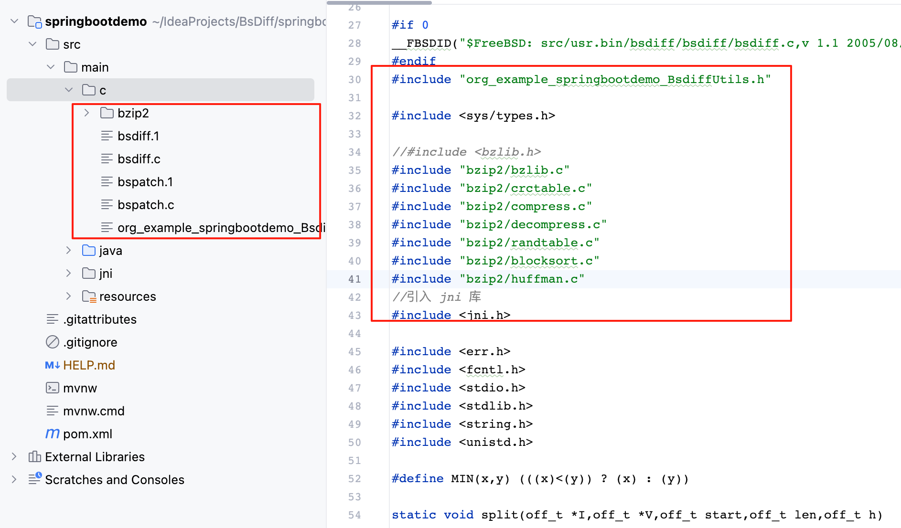
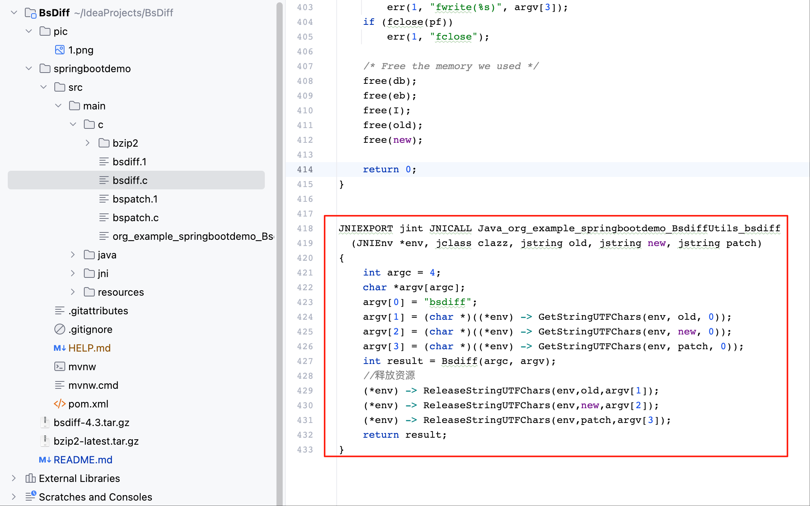
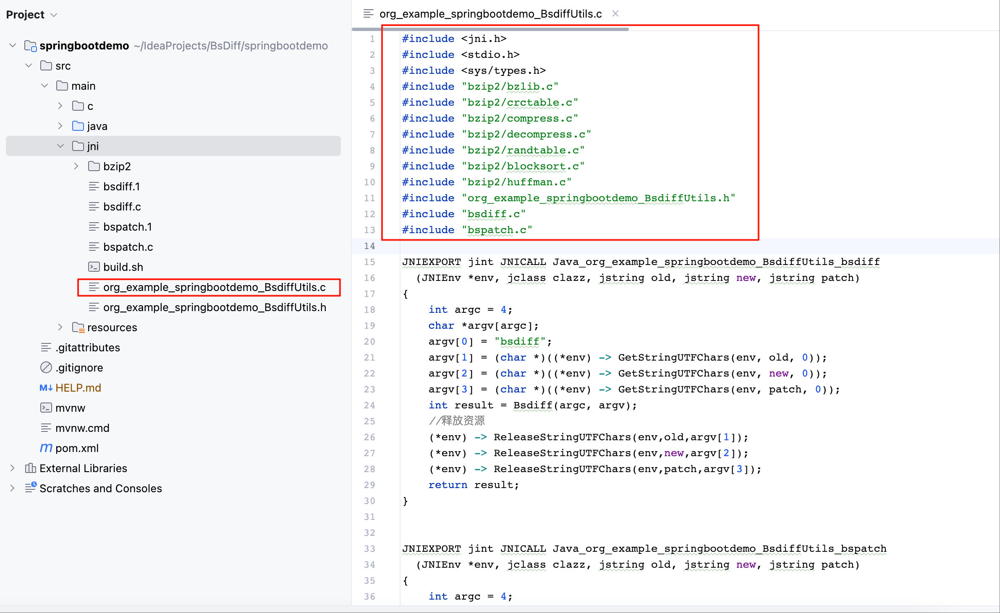

## 方式一

### 编译java文件为class
    javac org.example.springbootdemo.BsdiffUtils.java

### 生成org_example_springbootdemo_BsdiffUtils.h头文件
    javah -jni -classpath /Users/wangwc/IdeaProjects/springbootdemo/target/classes org.example.springbootdemo.BsdiffUtils

### 进入c目录，将bzip2和bsdiff源码放入c目录
    cd c

### 修改bsdiff.c
    #include "org_example_springbootdemo_BsdiffUtils.h"
    #include <sys/types.h>
    //#include <bzlib.h>
    #include "bzip2/bzlib.c"
    #include "bzip2/crctable.c"
    #include "bzip2/compress.c"
    #include "bzip2/decompress.c"
    #include "bzip2/randtable.c"
    #include "bzip2/blocksort.c"
    #include "bzip2/huffman.c"
    //引入 jni 库
    #include <jni.h>
    
    mian改成Bsdiff

### 新增代码

    JNIEXPORT jint JNICALL Java_org_example_springbootdemo_BsdiffUtils_bsdiff
      (JNIEnv *env, jclass clazz, jstring old, jstring new, jstring patch)
    {
        int argc = 4;
        char *argv[argc];
        argv[0] = "bsdiff";
        argv[1] = (char *)((*env) -> GetStringUTFChars(env, old, 0));
        argv[2] = (char *)((*env) -> GetStringUTFChars(env, new, 0));
        argv[3] = (char *)((*env) -> GetStringUTFChars(env, patch, 0));
        int result = Bsdiff(argc, argv);
        //释放资源
        (*env) -> ReleaseStringUTFChars(env,old,argv[1]);
        (*env) -> ReleaseStringUTFChars(env,new,argv[2]);
        (*env) -> ReleaseStringUTFChars(env,patch,argv[3]);
        return result;
    }

### 编译
    gcc -fPIC -D_REENTRANT -I/Library/Java/JavaVirtualMachines/jdk1.8.0_251.jdk/Contents/Home/include -I/Library/Java/JavaVirtualMachines/jdk1.8.0_251.jdk/Contents/Home/include/darwin -I/Users/wangwc/IdeaProjects/springbootdemo/src/main/c/bzip2 -I/Users/Ivonhoe/Downloads/VelocityDemo/src/main/c -c ./bsdiff.c

    gcc bsdiff.o -o bsdiff.so -shared -v

### 修改bspatch.c 参考bsdiff.c

    gcc -fPIC -D_REENTRANT -I/Library/Java/JavaVirtualMachines/jdk1.8.0_251.jdk/Contents/Home/include -I/Library/Java/JavaVirtualMachines/jdk1.8.0_251.jdk/Contents/Home/include/darwin  -I/Users/wangwc/IdeaProjects/springbootdemo/src/main/c/bzip2 -I/Users/wangwc/IdeaProjects/springbootdemo/src/main/c -c ./bspatch.c
    
    gcc bspatch.o -o bspatch.so -shared -v

## 方法二 bsdiff和bspatch

    jni目录
    cd ./jni
    gcc -fPIC -I/Library/Java/JavaVirtualMachines/jdk1.8.0_251.jdk/Contents/Home/include -I/Library/Java/JavaVirtualMachines/jdk1.8.0_251.jdk/Contents/Home/include/darwin  -shared -o libbsdiff.so org_example_springbootdemo_BsdiffUtils.c

## 注意事项
    1、System.loadLibrary 
     Java程序加载`.so文件时，如果使用System.loadLibrary("bsdiff")，
     JVM会先在java.library.path指定的目录中查找名为libbsdiff.jnilib`（Mac上是`.jnilib`，而非`.so`）的库文件，如果没有找到，才会尝试libbsdiff.so。
     如果在java.library.path中存在libbsdiff.so但不存在libbsdiff.jnilib，就会报no bsdiff in java.library.path的错误。
    /**
      * 1、linux -> *.so  mac -> *.jnilib   jnilib将so改后缀即可
      * 2、System.loadLibrary加载去除名称前面的lib和后缀
      * 3、运行时指定java.library.path  java -Djava.library.path=/Users/wangwc/IdeaProjects/BsDiff/springbootdemo/src/main/resources/libmac -jar xxx.jar
      */
      System.loadLibrary("bsdiff");

    2、System.load 绝对路径
    System.load("/Users/wangwc/IdeaProjects/BsDiff/springbootdemo/src/main/resources/lib/libbsdiff.so");

### 参考链接

[Java Native Interface (JNI)](https://www3.ntu.edu.sg/home/ehchua/programming/java/javanativeinterface.html
)

[以bsdiff.c和bspatch.c为例编译bsdiff.so](https://ivonhoe.github.io/2016/12/16/Mac-Linux%E4%B8%8Bgcc%E7%BC%96%E8%AF%91%E5%8A%A8%E6%80%81%E9%93%BE%E6%8E%A5%E5%BA%93-so%E6%96%87%E4%BB%B6/index.html
)

[bsdiff-android](https://github.com/houjinyun/bsdiff-android
)

